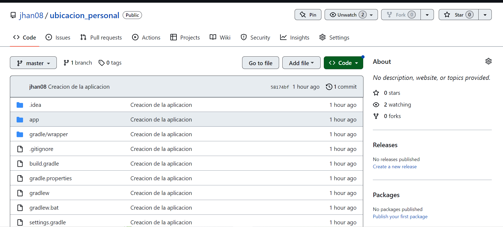
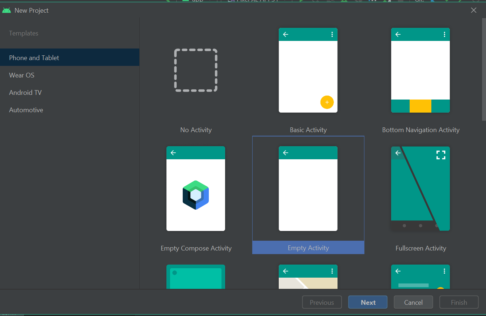
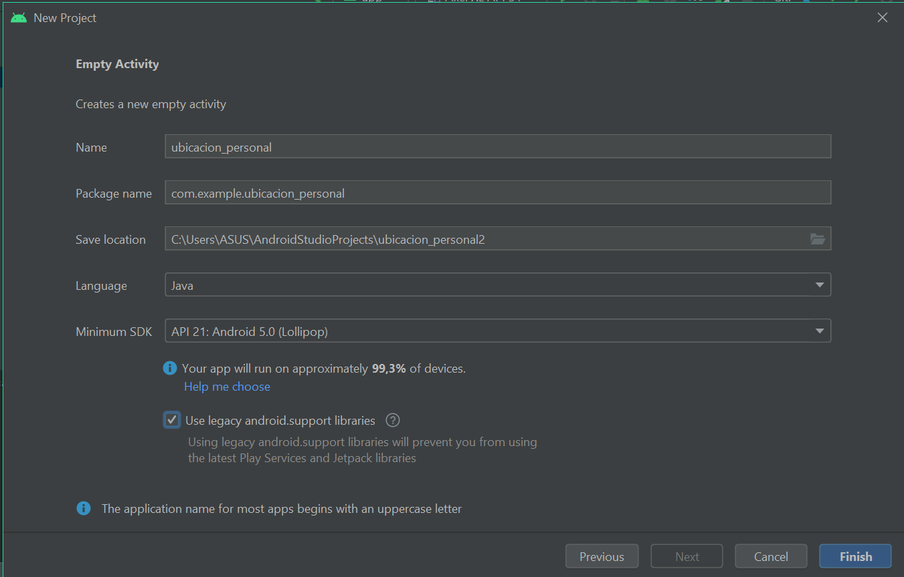
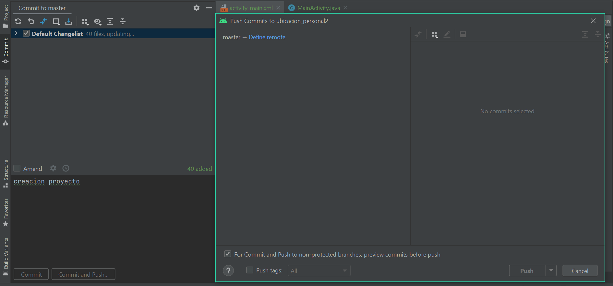

# DOCUMENTACION PARCIAL APPS MOVILES

# Integrantes

* Ronald Zambrano
* Alexander Sandoval
* Darly Rivera
* Jhan Brochero
* Luis Gomez

# Presentacion

Usando el programa Android Studio crearemos una app, en la cual digitaremos un usuario, y nos devolvera un mensaje en pantalla con el nombre de usuario, ubicacion y la hora de dicha consulta.

En este documento anexaremos los pasos realizados por cada uno de los integrantes del curso, desde que se crea el repositorio en GitHub hasta finalizada la app.

* El primer paso para empezar es crear un repositorio nuevo en GitHub para subir toda la documentacion del proyecto. El cual creamos con nombre "Ubicacion personal" y posteriormente invitar a todos los colaboradores.

 

* Posteriormente creamos una nueva Activity en Android Studios

 

* Nuestra nueva activity tomara como nombre ubicacion_personal

 

* Creamos el primer commit de lo que hemos hecho hasta el momento. El cual lo hacemos dando clic en git en menu superios y luego en commit. 

 

* Luego que ya tenemos la activity creada exitosamentem, podemos proseguir a crear la parte grafica de nuestra app.

Colocamos un texto plano en cual podremos digitar el nombre del usuario, acompañado de un boton que cuando lo accionemos nos mostrara el nombre de usuario, ubicacion y hora de consulta en un text view. 

 

Este fue nuestro primer avance.

* Esta seria la interfaz final de nuestra app

